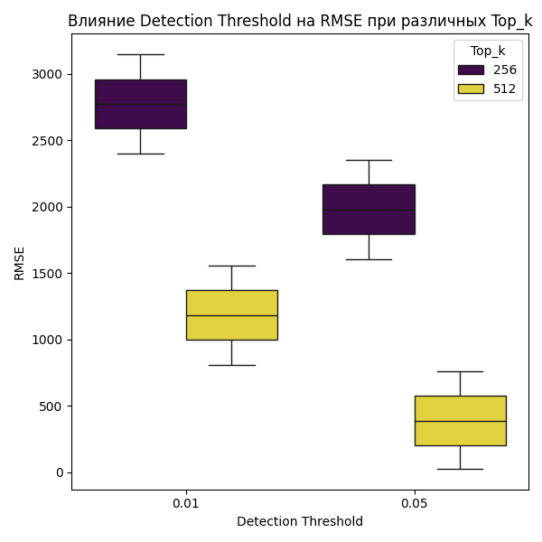
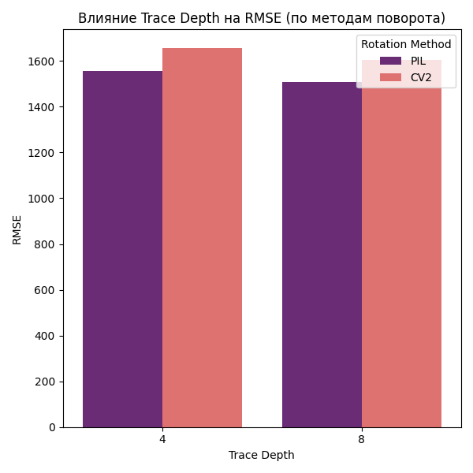
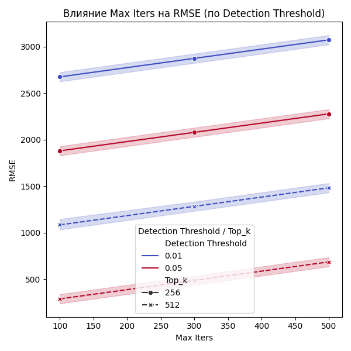

# Тестирование оптимизации параметров VIO для дрона

## Цель тестов

Основная задача тестирования заключалась в определении оптимальной конфигурации параметров визуальной инерциальной одометрии (VIO) для дрона. Целью было повысить FPS (количество кадров в секунду) без значительных потерь в точности, измеряемой через RMSE (среднеквадратичная ошибка).

## Подход к тестированию

### 1. Анализ оригинального кода

Первоначально был произведён анализ оригинального файла `vio_ort.py` для выявления основных узких мест. В ходе анализа были выделены следующие параметры, влияющие на производительность:

- **Top_k** — количество ключевых точек для сопоставления.
- **Detection Threshold** — порог детекции для алгоритма.
- **Max Iters** — максимальное количество итераций при поиске гомографии.
- **Rotation method** — метод обработки поворота изображения (PIL или CV2).
- **Trace depth** — глубина трейсинга (количество предыдущих кадров, используемых для расчёта перемещения).

### 2. Тестирование на компьютере

Для первичной оценки эффективности различных комбинаций параметров был разработан ноутбук `optimize_vio_performance.ipynb`. Основные шаги тестирования:

- **Загрузка данных.** Изображения и соответствующие JSON-файлы считываются из заданной директории.
- **Перебор параметров.** Генерируются все возможные комбинации параметров.
- **Вычисление метрик.** Для каждой комбинации параметров рассчитываются RMSE (с использованием разницы между координатами VIO и GPS) и время обработки.
- **Сохранение результатов.** Итоговые данные записываются в CSV-файл (`vio_results_updated.csv`) для дальнейшего анализа.

Однако результаты тестов на компьютере не соответствовали реальным условиям работы на дроне, так как:
- Вычислительная мощность компьютера значительно выше.
- Обработка файлов с диска отличается от обработки кадров, поступающих непосредственно с камеры дрона.

### 3. Тестирование на дроне

Для проверки параметров в реальных условиях каждая конфигурация тестировалась вручную на дроне. Тестирование проводилось следующим образом:
- **Настройка параметров.** Параметры конфигурации вручную корректировались в таблице, а затем фиксировались данные о времени обработки (FPS).
- **Полет и запись данных.** В процессе тестирования на дроне, моделировались реальные условия. Дрон оставался на месте, а его движение имитировалось с помощью различных манипуляций, таких как:
  - **Ручное перемещение дрона** с наклоном по осям под углом 90 градусов.
  - **Резкое движение объектов перед камерой**, включая быстрые приближения и удаления объектов.
  - **Перемещение объектов слева направо** и изменения угла обзора.
- **Ручной анализ.** Поскольку условия на дроне сильно отличались от лабораторных, выбор финальной конфигурации основывался на ручном сравнении полученных показателей RMSE и FPS при таких условиях.

## Анализ результатов

### Визуализация

Для визуального анализа влияния параметров на RMSE и FPS были построены графики, отражающие:

- **Влияние Detection Threshold на RMSE** для различных значений **Top_k**.
- **Влияние Trace Depth** на RMSE при использовании разных методов поворота (PIL vs. CV2).
- **Влияние Max Iters** на RMSE с различными значениями Detection Threshold и Top_k.

Пример графиков:

<div align="center">
    
</div>

<div align="center">
    
</div>

<div align="center">
    
</div>

### Выбор оптимальной конфигурации

Был разработан следующий алгоритм для выбора лучшей конфигурации:
1. Определить минимальное значение RMSE среди всех конфигураций.
2. Установить пороговое значение RMSE как минимальное RMSE плюс заданное допусковое значение (например, +300 м).
3. Среди конфигураций с RMSE ниже порога выбрать ту, у которой максимальное значение FPS.
4. Если конфигураций с допустимым RMSE нет, выбирать набор с наивысшим FPS.

#### Примеры вывода из консоли

**Пример 1:**
```
Лучшая конфигурация с минимальным RMSE (добавлен 100.0 метр): 
Top_k                         512
Detection Threshold          0.05
Max Iters                    None
Rotation method               PIL
Trace depth                     4
Mean Distance           65.836163
Max Distance           110.084439
RMSE                    66.705166
Avg FPS                       2.5
```

**Пример 2:**
```
Лучшая конфигурация с минимальным RMSE (добавлен 300.0 метр): 
Top_k                         512
Detection Threshold          0.05
Max Iters                   100.0
Rotation method               PIL
Trace depth                     8
Mean Distance          213.006844
Max Distance           254.176752
RMSE                   213.285128
Avg FPS                  4.933333
```

**Пример 3:**
```
Лучшая конфигурация с минимальным RMSE (добавлен 1000.0 метр): 
Top_k                         512
Detection Threshold          0.05
Max Iters                   100.0
Rotation method               CV2
Trace depth                     4
Mean Distance          361.944998
Max Distance           402.098768
RMSE                   362.108923
Avg FPS                  5.133333
```

## Итоговые выводы

В результате проведённого тестирования удалось выявить, что:
- **Базовые параметры оригинального кода** (`Top_k = 512`, `Detection Threshold = 0.05`, `Max Iters = None`, `Rotation method = PIL`, `Trace depth = 4`) дают довольно низкие значения RMSE (около 66.7 м), но работают с низким FPS (~2.5).
- **Изменение параметров** `Max Iters` до 100 и повышение `Trace depth` до 8 позволяет повысить FPS до ~4.93, но приводит к увеличению RMSE (до 213 м).
- **Использование метода CV2** при тех же параметрах может ещё больше увеличить RMSE, хотя FPS может быть выше.

Таким образом, оптимальная конфигурация для дрона зависит от компромисса между точностью (RMSE) и скоростью обработки (FPS). В конечном итоге выбор конфигурации должен базироваться на конкретных требованиях миссии дрона: если приоритетом является высокая скорость обработки, можно пожертвовать точностью, и наоборот.

---

## Рекомендации по применению

1. **Тестирование на дроне.** Результаты, полученные на компьютере, служат лишь ориентиром. Реальное тестирование на дроне обязательно для окончательного выбора конфигурации.
2. **Финальная версия VIO.** Для эксплуатации на дроне рекомендуется использовать оптимизированную версию `vio_ort.py` с параметрами, выбранными на основе полевых испытаний.

---

## Пример запуска оптимизации

Запустите ноутбук `optimize_vio_performance.ipynb` для воспроизведения процесса оптимизации. По завершении тестирования результаты сохраняются в файле `vio_results_updated.csv`, а затем с помощью скрипта `reformate_fps.py` производится анализ и выбор оптимальной конфигурации. Итоговый вывод с параметрами и значениями FPS отображается в консоли.
